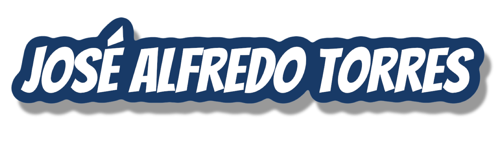
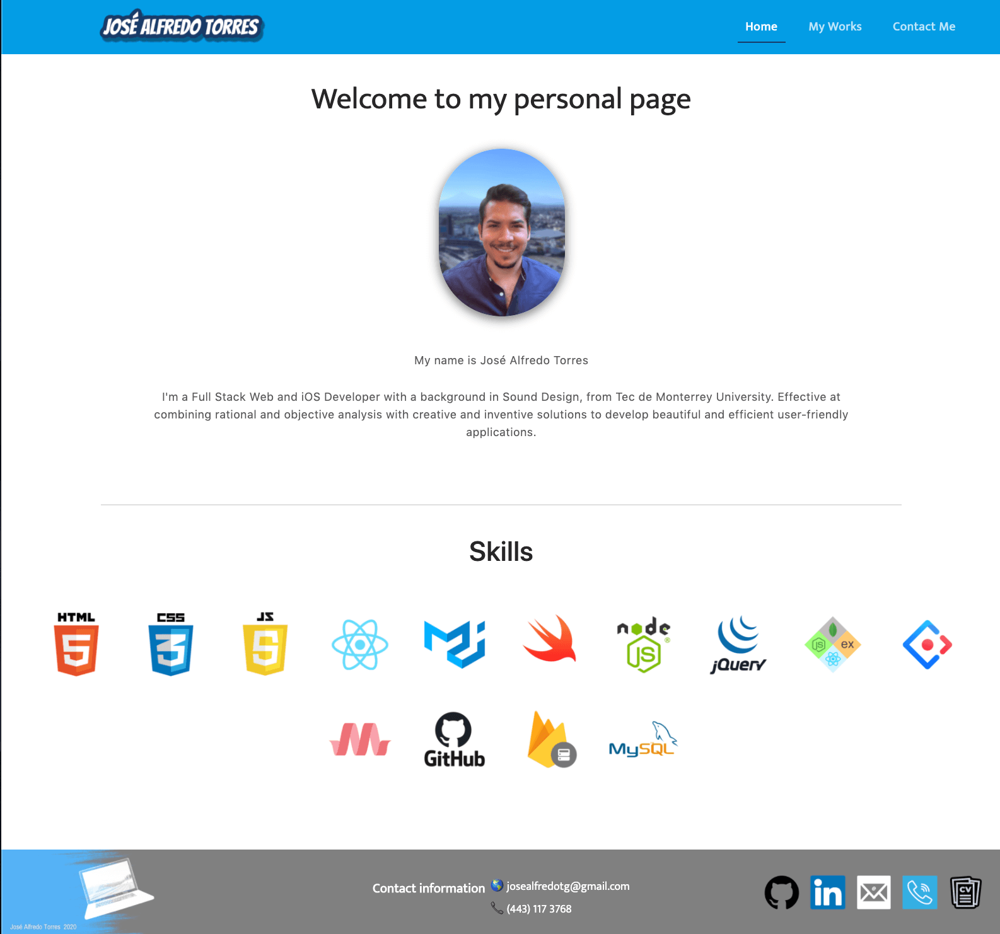

# My Portfolio

Welcome to my portfolio's repository. It was created using ReactJS, MaterialUI and NodeJS.

## How to install and run

In order to download it, you will need to follow this steps: 

            1. git clone https://github.com/alfa9317/jatg-portfolio
            2. cd into the jatg-portfolio
            3. Run npm install to all dependencies
            4. Run npm start
            5. Go to localhost:3000 in your web browser
            
            You will need to have previously installed NodeJS 

## --------------------👉🏻

## I just want to see it!

You can also just go to this url and see it:
      https://www.josealfredotorres.me

Required technologies:
NodeJS,
ReactJS,
MaterialUI,
Bazaart (graphic design),
Visual Studio Code.